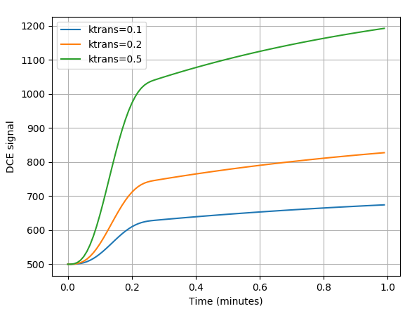
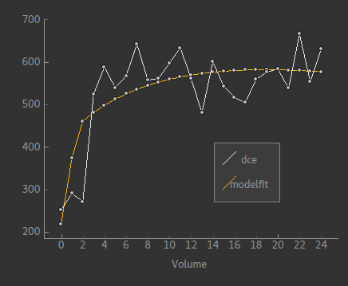

PYFAB tutorial
==============

This tutorial demonstrates basic use of the PYFAB API. For more detailed information see the
API reference.

Creating the API interface object
~~~~~~~~~~~~~~~~~~~~~~~~~~~~~~~~~

A command line interface object is created by::

    from fabber import FabberCl
    fab = FabberCl()

A shared library interface object is created by::

    from fabber import FabberShlib
    fab = FabberShlib()

Since both objects implement the same interface, for the remainder of this tutorial we will
not specify which is being used.

Querying models
~~~~~~~~~~~~~~~

A list of known models can be found by::

    >>>fab.get_models()
    [u'asl_2comp', u'asl_multiphase', u'aslrest', u'buxton', u'cest', u'dce', u'dce_2CXM', 
     u'dce_2CXM_LLS', u'dce_AATH', u'dce_CTU', u'dce_CTU_LLS', u'dce_ETM', u'dce_ETM_LLS', 
     u'dce_LLS', u'dce_Patlak', u'dce_tofts', u'dsc', u'dsc_cpi', u'dwi', u'dwi_IVIM', u'ir', 
     u'linear', u'pcASL', u'pcasl-dualecho', u'poly', u'q2tips', u'q2tips-dualecho', u'quasar', 
     u'quipss2', u'satrecov', u'turboquasar', u'vfa']

This returns all models in all model groups. To restrict the models to those in a particular
group, you can do::

    >>>fab.get_models(model_group="dce")
    [u'dce', u'dce_2CXM', u'dce_2CXM_LLS', u'dce_AATH', u'dce_CTU', u'dce_CTU_LLS', u'dce_ETM', 
     u'dce_ETM_LLS', u'dce_LLS', u'dce_Patlak', u'dce_tofts', u'linear', u'poly']

Each model has a description and a list of options which can be returned by the ``get_options`` 
method. An option is described my a mapping with keys ``name``, ``description``, ``type`` and
``optional``::

    >>>model_options, description = fab.get_options(model="dce_tofts")
    >>>for option in model_options:
    >>>  print(option["name"])
    delt
    fa
    tr
    r1
    aif
    sig0
    t10
    delay
    vp
    infer-vp
    infer-delay
    infer-ve
    infer-sig0
    infer-t10
    auto-init-delay
    aif-file
    aif-hct
    aif-t1b
    aif-ab
    aif-ag
    aif-mub
    aif-mug
    >>> print(model_options[0]["description"])
    Time resolution between volumes, in minutes
    >>> print(model_options[0]["type"])
    FLOAT
    >>> print(model_options[0]["optional"])
    False

In addition you can query the names of parameters of a model and additional timeseries outputs 
it is capable of generating. However to do this you need to pass the model sufficient information
to configure itself (because the parameter list for example might vary depending on the model
configuration). This is done by passing an ``options`` dictionary. The keys in ``options`` should
be option names, as shown above. The values may be strings, numeric values, booleans, Numpy 
arrays (for matrix options or data options) or Nibabel images (for data options).

``options`` must also contain any other Fabber options required for the operation being performed.
In this case we must supply the model name using the key ``model``. If we want to actually run
the model fitting, additional options are required - see below.

A model generally has some options which must be specified::

    >>> print(", ".join([option["name"] for option in model_options if not option["optional"]]))
    delt, fa, tr, r1, aif
    >>> print(", ".join([option["type"] for option in model_options if not option["optional"]]))
    FLOAT, FLOAT, FLOAT, FLOAT, STR
    >>> print("\n".join([option["description"] for option in model_options if not option["optional"]]))
    Time resolution between volumes, in minutes
    Flip angle in degrees.
    Repetition time (TR) In seconds.
    Relaxivity of contrast agent, In s^-1 mM^-1.
    Source of AIF function: orton=Orton (2008) population AIF, signal=User-supplied vascular signal, conc=User-supplied concentration curve

So as a minimum, these are what we need to provide some reasonable values for these options, 
such as the following::

    >>> options = {
    ...   "model" : "dce_tofts",
    ...   "delt" : 0.1,
    ...   "fa" : 12,
    ...   "tr" : 0.0041,
    ...   "r1" : 3.7,
    ...   "aif" : "orton"
    ... }
    >>> fab.get_model_params(options)
    [u'ktrans', u'kep']

With this configuration, the model has two parameters, ``ktrans`` and ``kep``. Different options
might give us different parameters::

    >>> options["infer-t10"] = True
    >>> fab.get_model_params(options)
    [u'ktrans', u'kep', u't10']

Evaluating a model
~~~~~~~~~~~~~~~~~~

The main purpose of PYFAB is model fitting - determining the parameters of the model from
input data. However it is often useful to be able to see the model output given parameter
values. We can do this using the ``model_evaluate`` method. This also requires options to configure
the model, as above, but we also pass a mapping from parameter name to value. Finally we must
provide the number of output volumes (time points) that we require using the ``nvols`` parameter. 

In some models this may be
determined by the configuration (e.g. in an ASL sequence we may have configured the model for
a certain number of PLDs and repeats, and this determines the number of output data points). However
for other models this is not fixed by the configuration, so it must always be specified during 
evaluation.

Here we are using the same model configuration as above, but we will remove the ``t10`` parameter
to simplify things::

    >>> options["infer-t10"] = False
    >>> params = {
    ...   "ktrans" : 0.1,
    ...   "kep" : 0.5,
    ... }
    >>> fab.model_evaluate(options, params, nvols=10)
    [1.0, 1.05983, 1.21943, 1.26262, 1.27866, 1.29335, 1.30679, 1.31905, 1.33021, 1.34035]

This represents the DCE signal curve. In a real acquisition the baseline signal is likely
to be much larger, so a more realistic signal would come from setting this::

    >>> options["sig0"] = 500
    >>> fab.model_evaluate(options, params, nvols=10)
    [500.0, 529.914, 609.715, 631.31, 639.33, 646.676, 653.393, 659.523, 665.104, 670.174]

We can use this to generate model curves to see how parameters vary. In the example below we 
reduce the time interval between volumes ``delt`` to a value of 0.01 minutes (
much smaller than we could achieve in reality) and generate 100 volumes so we can see
how the signal curves vary with the ``ktrans`` parameter::

    >>> options["delt"] = 0.01
    >>> nvols = 100
    >>>
    >>> import matplotlib.pyplot as plt
    >>> import numpy as np
    >>>
    >>> t = np.arange(0, options["delt"]*nvols, options["delt"])
    >>> options["ktrans"] = 0.1
    >>> y1 = fab.model_evaluate(options, params, nvols=nvols)
    >>> options["ktrans"] = 0.2
    >>> y2 = fab.model_evaluate(options, params, nvols=nvols)
    >>> options["ktrans"] = 0.5
    >>> y3 = fab.model_evaluate(options, params, nvols=nvols)
    >>>
    >>> plt.plot(t, y1, label="ktrans=0.1")
    >>> plt.plot(t, y2, label="ktrans=0.2")
    >>> plt.plot(t, y3, label="ktrans=0.5")
    >>> plt.xlabel("Time (minutes)")
    >>> plt.ylabel("DCE signal")
    >>> plt.legend()
    >>> plt.grid(True)
    >>> plt.show()
    

Running model fitting
~~~~~~~~~~~~~~~~~~~~~

To run model fitting, we need the model configuration (options) plus the following:

  - Inference method configuration
  - Data to fit the model to
  - (ideally) A mask image

The minimal configuration options for inference are::

    options["method"] = "vb"
    options["noise"] = "white"

This uses the Variational Bayes inference method ``vb`` which is the standard for Fabber. 
An alternative non-linear least squares implementation ``nlls`` is also provided for comparison
but is not recommended. Inference requires a noise model, white noise is the most common option 
here.

The data we want to fit can be provided using the ``data`` configuration option, and can be
given as any of the following:

  - A ``nibabel`` image
  - A 4D Numpy array
  - A string, which will be interpreted as the filename of a ``nibabel`` compatible image file

Providing a data mask using the ``mask`` configuration option is strongly recommended. 
With most data sets we are only really interested
in a particular region (e.g. the brain, or other part of the body) and not providing a mask 
increases runtime significantly as 'uninteresting' voxels are processed as well. In some cases
the absence of recognizable signal in these 'uninteresting' voxels can cause numerical instability
and the failure to fit at all.

Fitting is done using the ``run`` method which takes the configuration options and an optional
'progress' callback which is called periodically during fitting with a numeric value indicating
the progress towards completion, in the range 0-1. A built in progress callback which outputs
a percentage to an output stream is returned by the function ``fabber.percent_progress(stream)``.

Below is a complete example of inference of a DCE data set. The model configuration options
are taken from acquisition data stored in the original DICOM files::

    import sys
    from fabber import FabberCl, percent_progress

    fab = FabberCl()

    # File names containing DCE data and mask image
    data = "dce.nii.gz"
    mask = "reg/roi.nii.gz"

    # Set up the model and inference configuration options
    options = {
        "data" : data,           # 4D DCE data 
        "mask" : mask,           # Only process voxels within this binary mask
        "method" : "vb",         # Variational Bayes method (non-spatial)
        "noise" : "white",       # Standard white noise model
        "model" : "dce_tofts",   # Standard Tofts model
        "delt" : 0.158,          # Time between volumes in minutes (i.e. 9.5s)
        "tr" : 4.5,              # Sequence TR in seconds
        "fa" : 12.0,             # Flip angle in degrees
        "r1" : 4.1,              # T1 relaxivity of ProHance at 1.5T
        "aif" : "orton",         # Use Orton population average AIF
        "infer-sig0" : True,     # Infer the baseline signal
        "infer-delay" : True,    # Infer the bolus injection delay
        "save-model-fit" : True, # Save the model predicted fit
    }

    # Run the model fitting
    run = fab.run(options, progress_cb=percent_progress(sys.stdout))

    # Basic interaction with the run output
    print("\nOutput data summary")
    for name, data in run.data.items():
        print("%s: %s" % (name, data.shape))
    print("Run finished at: %s" % run.timestamp_str)

    # Write full contents out to a directory
    run.write_to_dir("pyfab_out")

This example shows (very briefly) how to interact with the output run data which is
returned as Numpy arrays. It also demonstrates the ``write_to_dir`` method which writes
all the output data (as Nifti files) plus the logfile to a directory. 

The image below shows an example of the model fit for a single voxel within the mask:

Spatial regularization
~~~~~~~~~~~~~~~~~~~~~~

There is an additional model fitting option which is sufficiently important to mention at this
point, namely *spatial regularization*. For full details of this option see the Fabber documentation,
however it is a means of implementing adaptive spatial smoothing on the parameter values within
the Bayesian framework rather than as an ad-hoc postprocessing step. 

Essentially it consists of
assuming some degree of spatial uniformity in a parameter, with the degree of uniformity inferred
from the actual data. If the data contains enough information to justify sharp differences in 
a parameter's value from
one voxel to its spatial neighbours then this will be preserved, but if there is not enough 
information in the data to justify this then a smoother output map is generated.

To use spatial regularization we set the method option to ``spatialvb`` and must in addition 
specify at least one *spatial prior*. Normally this is given on a parameter which controls the
overall scale of the output - through the interaction between the parameters this will tend to
have the effect of smoothing other parameters as well.

This is how we would set a type-M spatial prior on the ``ktrans`` parameter::

    options["method"] = "spatialvb"
    options["PSP_byname1"] = "ktrans"
    options["PSP_byname1_type"] = "M"

For a full description of the ``PSP_byname`` family of options see the more detailed 
documentation for ``fabber_core``.

Alternate model outputs
~~~~~~~~~~~~~~~~~~~~~~~

Some models are able to output alternatives to their default model prediction. Usually this
would be some intermediate output calculated during evaluation of the model which is 
potentially interesting in its own right. Examples might include residual and AIF curves
for models based on tracer kinetics such as ASL and DCE. Not all models, however, 
provide these alternative outputs.

Alternative outputs can be listed using the ``get_model_outputs`` method and 
evaluated using the ``model_evaluate`` function by providing
the optional argument ``output_name``. This example shows the DSC model which provides
the residual curve as an alternative output::

    >>> options = {
    ...   "model" : "dsc",
    ...   "delt" : 0.1,
    ...   "te" : 65,
    ...   "aif" : "aif.txt",
    ... }
    >>> params = {
    ...   "sig0" : 100,
    ...   "cbf" : 1,
    ... }
    >>> fab.model_evaluate(options, params, nvols=10)
    [100.0, 107.177, 111.612, 114.87, 117.462, 119.624, 121.482, 123.116, 124.574, 125.894]
    >>> fab.get_model_outputs(options)
    [u'dsc_residual']
    >>> fab.model_evaluate(options, params, nvols=10, output_name="dsc_residual")
    [1.0, 1.82291e-05, 1.22265e-05, 9.05678e-06, 7.02383e-06, 5.59777e-06, 4.54382e-06, 3.73772e-06, 3.10599e-06, 2.60186e-06]

Alternative outputs can also be included in the output data from a model fitting run.
This is done by setting the option ``save-model-extras`` to ``True``.
